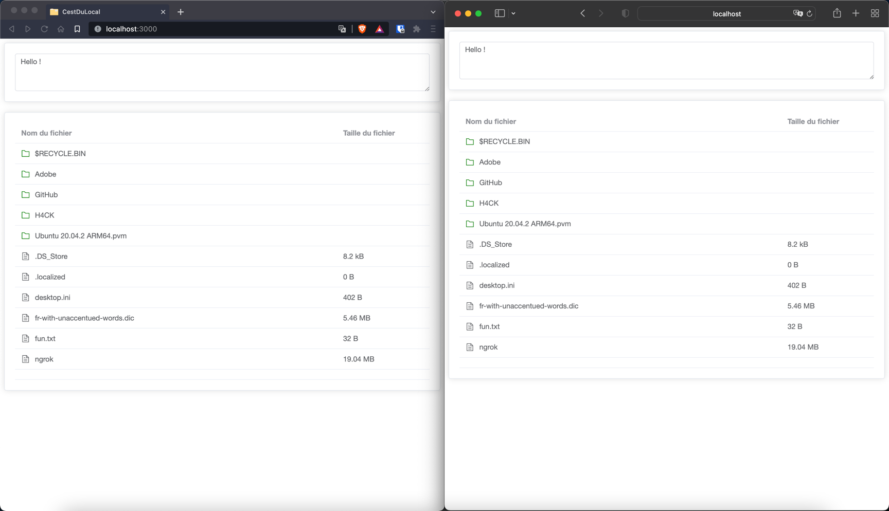

# CestDuLocal

## Example usage

Add this to your `.bashrc`(or similar):

```bash
alias cdl="/tmp/jaaj/App"
```

> Of course, you can move the App executable to any location you want.

Go to the directory you want, run `cdl` and then go to `http://localhost:3000`

## Requirements

* Node.js 16 (you can use `nvm` to install Node.js versions)
* [pnpm](https://pnpm.io/)

```
./build.sh
```


